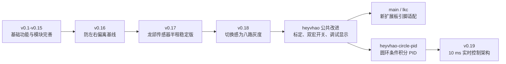

# 版本关系与开发进展

本文记录 `dian-sai-2026-mspm0-car` 仓库中各版本的继承关系。仓库里同时保留了
不同传感器和不同扩展板引脚的工程支线，因此“版本号更高”不一定表示可以直接烧录到
另一套硬件，烧录前必须先核对 README 接线表和 SysConfig 引脚。

## 关系图

## 版本里程碑

| 版本 | 工程阶段 | 主要进展 | 适用说明 |
| --- | --- | --- | --- |
| `v0.1-v0.6` | MSPM0 基础移植 | 建立电机、PWM、编码器、循迹、OLED、导航和陀螺仪模块，并补齐文档 | 早期功能基线 |
| `v0.7-v0.11` | 可读性与诊断 | 中文注释、MS901M 数据显示、UART 帧诊断和循迹参数调整 | 便于接线和排错 |
| `v0.12-v0.14` | 编码器速度闭环实验 | 加入并调整轮速 PI，OLED 增加轮速诊断 | 实验分支思路，不是当前控制方案 |
| `v0.15` | 简化电机控制 | 删除编码器速度 PI，恢复 PWM 直接控制；编码器保留用于测速和里程信息 | 当前方案的电机控制基线 |
| `v0.16` | 防偏离基线 | 改进丢线方向记忆，降低极端震荡后朝错误方向继续转动的概率 | 龙邱八路灰度 |
| `v0.17` | 赛道验证版 | 可稳定跑完 2024 年 E 题半程 | 龙邱八路灰度，已有实车结果 |
| `v0.18` | 感为传感器迁移 | 改用感为无 MCU 八路灰度，完成地址选通、单 ADC 轮询和归一化框架 | PID 仍需按实车调整 |
| `v0.18` 后续 | `heyvhao` 公共改进 | 加入黑白标定入口、巡线/调试双宏开关、OLED 诊断和 45 度转向开关 | `lkc` 与圆环 PID 的共同祖先 |
| `v0.19` | `heyvhao` 实时控制版 | 圆环条件积分 PID、TIMG7 10 ms 控制中断、UART 环形缓冲、100 ms OLED 后台刷新 | 本文所在版本，已编译，待实车复核 |

## 当前分支关系

- `main`：当前保存 `lkc` 扩展板的 TB6612 PWM 和引脚适配，不应直接当作 `heyvhao` 引脚版烧录。
- `heyvhao-circle-pid`：从共同的感为传感器调试版分出，加入圆环条件积分 PID，是 `v0.19` 的直接父版本。
- `codex/heyvhao-realtime-control`：在圆环 PID 版上继续加入 10 ms 实时调度，是当前 `heyvhao` 发布支线。
- `mspm0-v0.19`：指向当前实时控制版的固定快照，建议复现实验时优先使用标签，而不是随分支继续变化的最新提交。

## v0.19 的结构进展

1. TIMG7 每 10 ms 触发一次控制步，固定执行编码器更新、灰度采样、导航/PID 和 PWM 更新。
2. 主循环不再使用 `Delay_ms(10)`，只处理 MS901M 协议和每 100 ms 一次的 OLED 刷新，空闲时进入 `__WFI()`。
3. UART ISR 只收字节，256 字节环形缓冲区把耗时的校验、解析和 `memmove` 留给主循环。
4. 编码器 GPIO、UART 和控制定时器设置了明确优先级，减少任务之间相互拖慢和丢采样的概率。
5. 控制定时器在全部模块初始化后才启动，并增加控制周期与编码器/OLED 周期的编译期检查。

## 验证状态与下一步

- 已完成 TI 编译器 clean build，无警告，输出为 `Debug/heyvhao.out`。
- 尚未完成本版本的实车赛道验证，不能把“编译通过”等同于“PID 已经调好”。
- 感为八路 ADC 仍在控制中断内轮询；正常一次约 1.6 ms，应使用空闲 GPIO 测量中断占用并确认始终明显小于 10 ms。
- 固定 10 ms 周期会让 D 项和 I 项比旧的可变周期循环更可重复，但实车上仍可能需要小幅重调 PID。
- 启用陀螺仪转向后，应观察 `MS901M_GetRxQueueOverflowCount()` 保持为 0；必要时可在转向期间暂停 OLED 刷新。
